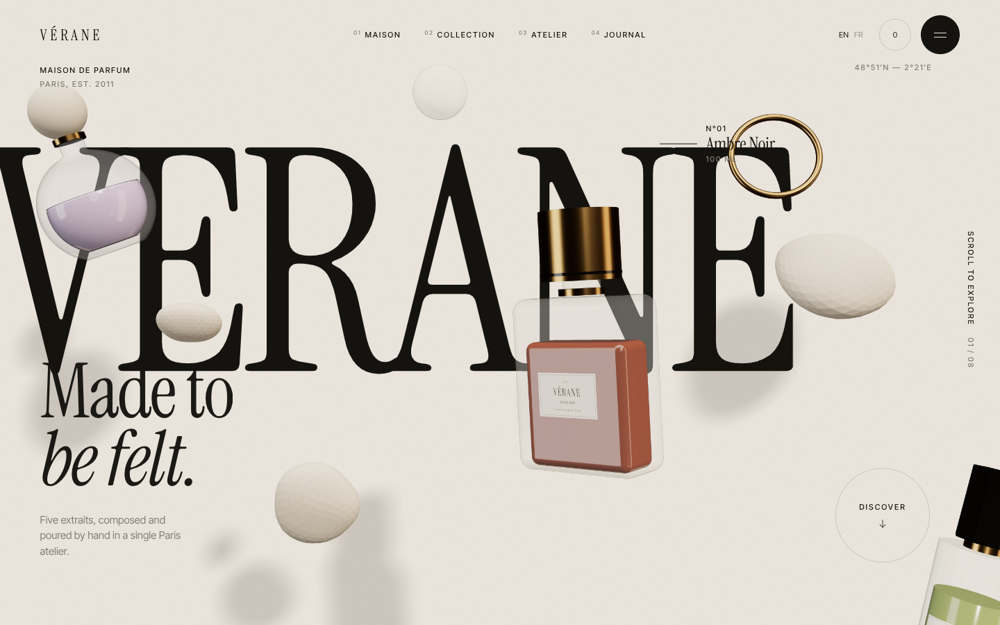
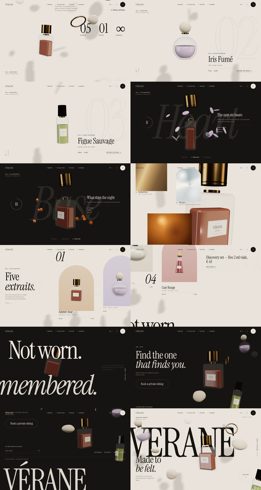

# VÉRANE — immersive 3D brand site

An editorial, scroll-driven 3D website for a fictional Paris perfume house. **VÉRANE** stands in for `[BRAND / BUSINESS NAME]`. All copy, products and colours live in [`src/brand.js`](src/brand.js), so you can re-skin the site from that one file.



## Run

```bash
npm install
npm run dev      # http://localhost:5173
npm run build    # static output in dist/
```

## Stack

React 19 · Three.js via React Three Fiber + drei · GSAP ScrollTrigger · Lenis smooth scroll · Framer Motion · Vite.

## The scroll story (8 sections)

| # | Section | What happens |
|---|---|---|
| 1 | Hero | Oversized wordmark behind three floating bottles, an asymmetric composition, a magnetic CTA |
| 2 | Story | Scrubbed word-by-word reveal, outlined type drifting sideways, pebbles and brass rings rising at different depths |
| 3 | Showcase | Sticky. Three signature bottles take turns flying through, with masked type swaps and a giant outlined number |
| 4 | Experience | Sticky, dark. The cap lifts and each act's raw materials orbit the bottle: citrus (top), iris petals (heart), resin and vetiver (base) |
| 5 | Details | Extreme close-up of the bottle, large spec numbers, material panels revealed with clip-path that ripple on hover (SVG displacement) |
| 6 | Collection | Vertical scroll drives a horizontal track. Each 3D bottle is pinned to its DOM arch every frame, so it moves with the panels |
| 7 | Statement | Full-screen type. The bottle drifts between one line in front of the canvas and one behind it |
| 8 | Finale | One strong CTA, a newsletter field, and a cropped wordmark in the footer |

## How it works

- **One fixed, transparent canvas** sits behind the content. Layering: `.under` and sticky layers sit at z 0 (type behind the 3D), the canvas at z 1, and copy and UI at z 2. Sticky sections that need type on both sides of the 3D use a back and a front sticky layer.
- **Choreography** (`src/three/choreography.js`): each bottle has keyframes keyed on a continuous section coordinate `s` (3.5 means halfway through section 3). Positions are screen fractions measured at each object's own depth, so the composition holds at any aspect ratio. Actors damp toward their targets, then add pointer parallax and an idle float on top.
- **DOM anchoring** (`src/three/Actor.jsx`): in the collection, actors blend toward the projected rect of their `[data-anchor]` element.
- **Models** are built in code: lathe, rounded-box and frustum geometry, two-pass glass, liquid, brass and stone, and canvas-drawn labels. Reflections come from a `Lightformer` studio environment, so the site needs no HDR or GLB downloads.
- **Performance**: the 3D chunk is lazy-loaded behind the loader. `PerformanceMonitor` drops the pixel ratio when frame rate falls. On mobile, shadows are off and there are fewer floating objects and notes, but the same choreography runs.
- **Accessibility**: respects `prefers-reduced-motion` (no Lenis, no float, instant intros). The custom cursor only appears on fine-pointer devices. The menu closes on Esc.

## Re-skinning for another business

1. Edit `src/brand.js`: name, copy and products (`liquid`, `glass` and `arch` colours tint the 3D).
2. For a product that isn't a bottle, replace the components in `src/three/Bottles.jsx`, or load a GLB with drei's `useGLTF` inside the same `Normalize` wrapper. Keep the ids in `models` matching `products`.
3. Change the palette in the `:root` tokens and `THEMES` in `App.jsx`.


